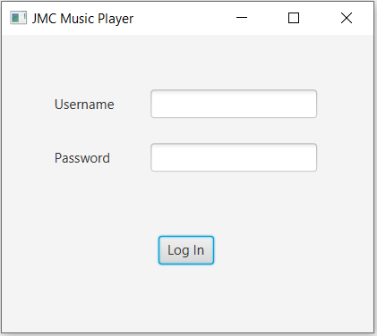
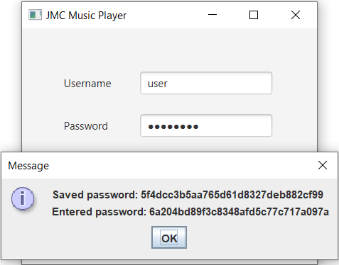
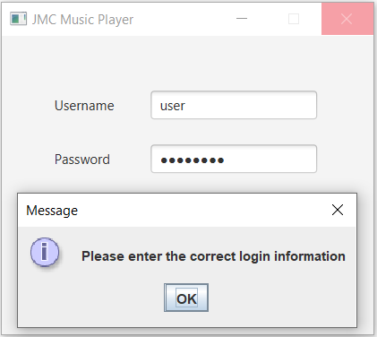
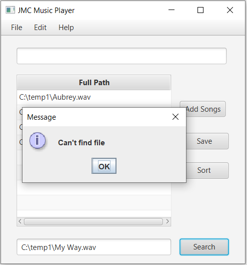
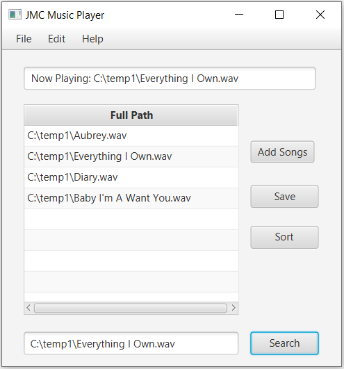
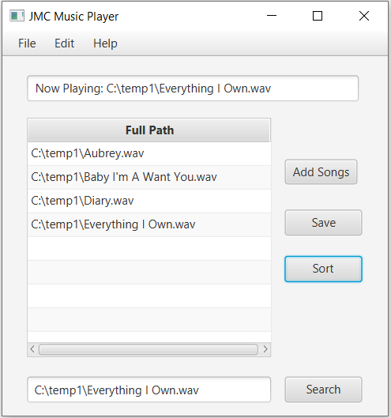
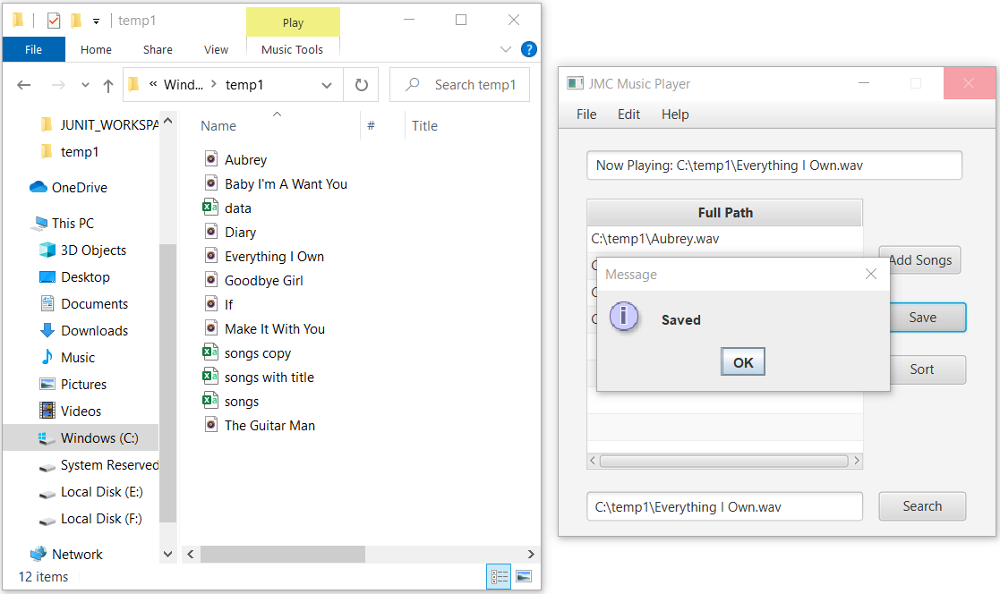
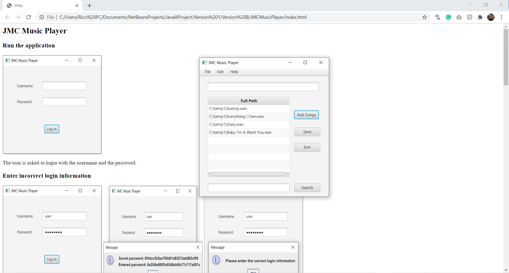

<h1>JMCMusicPlayer-Java</h1>

<em>This project is developed according to South Metropolitan TAFE requirements.</em>

 * Developer: Jose Rico Imbang
 * Student Id: 30019932
 * Date: 03/12/2020
 * AT3 - Project
 * South Metropolitan TAFE, Diploma of Software Development
 * Third party library link - https://www.javatpoint.com/how-to-read-csv-file-in-java

<h2>Introduction</h2>

The JMC Music Player is an application designed for Jupiter Mining Corporation employees. The users need to log in using their credentials (the application uses hashing technique) to be able to use the application to search, play and sort the songs stored in a binary tree. The application loads and saves the path of the songs from and into a CSV file using a third-party library.

The algorithm used for sorting is merge sort, and binary search for searching.

Please see the How-To Guide by clicking Help from the menu bar for assistance in operating the application.

 
<table border="1" cellpadding="4" cellspacing="0">
  <thead>
    <tr>
      <th>Test Case</th>
      <th>Description</th>
      <th>Expected Outcome</th>
      <th>Screenshot</th>
    </tr>
  </thead>
  <tbody>
    <tr>
      <td>Case 1</td>
      <td>Run the application</td>
      <td>The user is asked to login with the username and the password.</td>
      <td></td>
    </tr>
  </tbody>
  <tbody>
    <tr>
      <td>Case 2</td>
      <td>Enter incorrect login information</td>
      <td>A message shows up showing the hashed saved and entered password <strong>(FOR DEMO PURPOSES ONLY)</storng>. Another message is shown saying the login information is incorrect.</td>
      <td></td>
    </tr>
  </tbody>
  <tbody>
    <tr>
      <td>Case 3</td>
      <td>Enter correct login information</td>
      <td>A message shows up showing the hashed saved and entered password <strong>(FOR DEMO PURPOSES ONLY)</storng> then the Music Player is shown.</td>
      <td></td>
    </tr>
  </tbody>
  <tbody>
    <tr>
      <td>Case 4</td>
      <td>Click Add Songs button</td>
      <td>The information for songs.csv are loaded containing the unsorted paths of the tracks and are shown in the table.</td>
      <td></td>
    </tr>
  </tbody>
  <tbody>
    <tr>
      <td>Case 5</td>
      <td>Type an incorrect path of a song into the Text Field and click Search button</td>
      <td>A friendly message is shown. </td>
      <td></td>
    </tr>
  </tbody>
  <tbody>
    <tr>
      <td>Case 6</td>
      <td>Type the correct path of the song into the Text Field and click Search button</td>
      <td>The song is played, and its full path is shown in the upper Text Field.</td>
      <td></td>
    </tr>
  </tbody>
  <tbody>
    <tr>
      <td>Case 7</td>
      <td>Click the Sort button</td>
      <td>The paths in the table are sorted alphabetically.</td>
      <td></td>
    </tr>
  </tbody>
  <tbody>
    <tr>
      <td>Case 8</td>
      <td>Click the Save button</td>
      <td>A message pops up saying whether it is successful or not. If successful, the information in the table are saved into a CSV file named songs copy.</td>
      <td></td>
    </tr>
  </tbody>
  <tbody>
    <tr>
      <td>Case 9</td>
      <td>Click Help from the menu bar then click About</td>
      <td>A help file is shown.</td>
      <td></td>
    </tr>
  </tbody>
</table>
